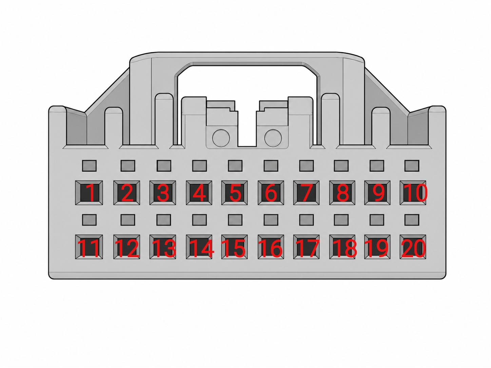
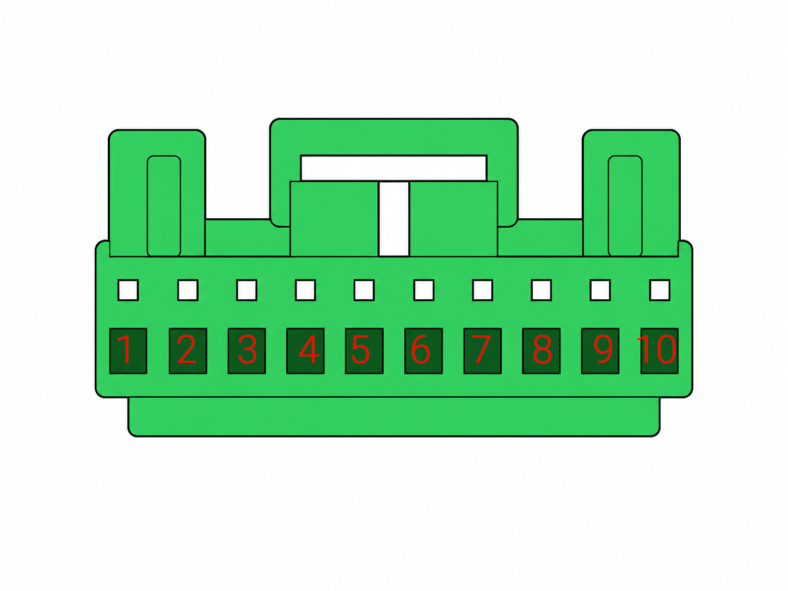

# Connector pinouts and electrical observations

## Scope

This document transcribes the current reverse-engineering worksheet for the
subject 2013 facelift Honda Accord CU2. It is **not an official Honda pinout**.

The tables preserve the observed wire colours and single-point multimeter
readings, while separating them from unverified function names. Values are
measurement snapshots, not nominal voltage specifications or safe GPIO levels.

> **Pin-numbering warning:** the numbering below follows the original worksheet.
> Connector-face versus harness-side orientation, latch position and row
> direction have not yet been documented here. Do not build a harness from these
> tables until photographs or drawings establish the viewing direction; a
> connector can otherwise be mirrored.

## Evidence conventions

- **Confirmed/observed** means directly visible or measured on the subject
  harness, but may still require repetition.
- **Working label** preserves the original reverse-engineering interpretation.
- A question mark means the function or direction is unconfirmed.
- `RX` and `TX` are ambiguous without naming the viewpoint. The current
  captures establish the working vehicle-wire directions for LKAS pins 3 and
  5, but do not prove that the physical-layer board labels use the same
  viewpoint.
- A DMM reading on a switching data line is an average-like snapshot and cannot
  establish waveform levels, baud rate or protocol.

The machine-readable transcription is stored in
[`research/pinouts/cu2_connector_measurements.csv`](../research/pinouts/cu2_connector_measurements.csv).

## ACC/ADAS controller connector — 20 cavities

> **Numbering reference only.** Latch is shown at the top. This drawing was
> carried over from the reverse-engineering worksheet. It does not yet prove
> whether the view is from the mating face or the harness/wire side. Confirm the
> physical connector orientation before fabricating or probing a harness.

| Pin | Wire colour | Observed voltage | Working label from worksheet | Current interpretation |
|---:|---|---:|---|---|
| 1 | white | 2.7 V | CAN H | **Strongly supported** F-CAN high; confirm by continuity and differential capture |
| 2 | black | — | ground | **Observed/likely** ground; confirm low resistance to chassis/module ground |
| 3 | teal | 9.3 V | K-line | **Open** single-wire/diagnostic candidate; do not call ISO K-line until framed traffic is captured |
| 4 | no terminal observed | — | — | Empty in subject harness; other variants may differ |
| 5 | no terminal observed | — | — | Empty in subject harness; other variants may differ |
| 6 | no terminal observed | — | — | Empty in subject harness; other variants may differ |
| 7 | no terminal observed | — | — | Empty in subject harness; other variants may differ |
| 8 | no terminal observed | — | — | Empty in subject harness; other variants may differ |
| 9 | blue | 11.9 V | ignition | **Likely** ignition-switched supply/input; verify ignition OFF/ACC/ON transitions |
| 10 | green | 0 V | brake | **Open** brake-related candidate; repeat with pedal released/pressed and ignition states |
| 11 | red | 2.2 V | CAN L | **Strongly supported** F-CAN low; confirm as pair with pin 1 |
| 12 | no terminal observed | — | — | Empty in subject harness; other variants may differ |
| 13 | no terminal observed | — | — | Empty in subject harness; other variants may differ |
| 14 | blue | 4.3 V | radar data | **Open** radar single-wire candidate; waveform and direction unknown |
| 15 | white | 11.9 V | brake light? | **Open** brake-lamp/switch candidate; verify state transitions and circuit ownership |
| 16 | red | 0 V | write enable | **Open** function unverified; do not drive this pin |
| 17 | no terminal observed | — | — | Empty in subject harness; other variants may differ |
| 18 | white | 11.5 V | 12 V | **Observed** supply-level voltage; verify whether constant battery or switched |
| 19 | black | — | ground | **Observed/likely** ground; confirm continuity |
| 20 | black | — | ground | **Observed/likely** ground; confirm continuity |

## LKAS camera/controller connector — 10 cavities

> **Numbering reference only.** Latch is shown at the top. This drawing was
> carried over from the reverse-engineering worksheet. It does not yet prove
> whether the view is from the mating face or the harness/wire side. Confirm the
> physical connector orientation before fabricating or probing a harness.

| Pin | Wire colour | Observed voltage | Working label from worksheet | Current interpretation |
|---:|---|---:|---|---|
| 1 | no terminal observed | — | — | Empty in subject harness; other variants may differ |
| 2 | no terminal observed | — | — | Empty in subject harness; other variants may differ |
| 3 | white | 6.3 V | RX? | **Strongly supported** serial steering candidate A; white T-harness wire was captured on ESP32 GPIO32 as a 5-byte EPS-to-LKAS candidate |
| 4 | teal | 9.3 V | K-line? | **Open** single-wire/diagnostic candidate; may be related to ACC pin 3, but continuity is not recorded |
| 5 | blue | 8.5 V | TX? | **Strongly supported** serial steering candidate B; blue T-harness wire was captured on ESP32 GPIO33 as a 4-byte LKAS-to-EPS candidate |
| 6 | brown | 11.8 V | 12 V | **Observed** supply-level voltage; constant versus switched not recorded |
| 7 | white | 2.7 V | CAN H | **Strongly supported** F-CAN high |
| 8 | red | 2.2 V | CAN L | **Strongly supported** F-CAN low |
| 9 | black | — | ground | **Observed/likely** ground; confirm continuity |
| 10 | no terminal observed | — | — | Empty in subject harness; other variants may differ |

## Captured serial-steering mapping

Captures 3 and 4, together with the documented T-harness colours, provide the
following working physical mapping:

| T-harness wire | LKAS connector pin | ESP32 input | Observed frame hypothesis | Confidence |
|---|---:|---:|---|---|
| white | 3 | GPIO32 | 5-byte EPS-to-LKAS feedback | Strongly supported |
| blue | 5 | GPIO33 | 4-byte LKAS-to-EPS command | Strongly supported |

The mapping assumes the white and blue wires in the T-harness are continuous
with LKAS pins 3 and 5 as shown in the worksheet; record a continuity check to
promote this from colour-plus-capture evidence to confirmed pin identity. The
physical-layer boards produced readable data from their pins marked `RX`; no
added resistors were used in captures 3 and 4. The high-level voltage of those
`RX` pins was not recorded separately, so electrical safety remains an open
follow-up. The earlier board pins marked `TX` measured 4.89 V and are not the
same as the working direct data connection.

## Important unresolved discrepancy

The worksheet records approximately **4.3 V** at ACC pin 14, labelled `radar
data`. Earlier project notes record approximately **8.5 V** on the separate
radar-to-ACC wire. These must not be merged into one canonical electrical value
until the exact measurement point, ignition state, connector loading and test
conditions are reconstructed.

Possible explanations include different ends of the link, different vehicle
states, a DMM averaging switching traffic, a pin-number/view mismatch, or an
incorrect working label.

## What the worksheet establishes

The sheet is useful evidence for:

- connector cavity population on the subject harness;
- wire-colour mapping;
- locating the likely shared F-CAN pair at both modules;
- locating supply and ground candidates;
- narrowing the wires that require synchronized scope/UART capture;
- preserving uncertain leads without promoting them to confirmed functions.

It does **not** establish:

- official connector numbering or orientation;
- nominal voltage limits;
- protocol type;
- signal direction;
- whether a line is safe to load with a particular transceiver;
- whether a supply is constant, accessory-switched or ignition-switched;
- whether function names such as `K-line`, `write enable`, `RX` or `TX` are correct.

## Validation plan

Before promoting any working label:

1. Add connector photographs or drawings for both mating faces with latch
   orientation and pin 1 clearly marked.
2. Repeat voltage measurements against a documented ground in these states:
   battery connected/ignition off, ACC, ignition on, engine running, brake
   released/pressed, ACC/LKAS off/on.
3. Confirm ground pins by resistance/voltage-drop tests.
4. Confirm CAN pins by continuity, approximately 60-ohm bus resistance when
   appropriate, and differential traffic capture.
5. Scope pins 3/4/5 at the LKAS connector and pins 3/14/16 at the ACC connector
   using high-impedance passive probing or suitable protected transceivers.
6. Capture both suspected steering channels together with F-CAN. Add event
   markers only when a passenger or stationary operator is available; for solo
   driving, derive LKAS-active intervals offline.
7. Record whether measurements were taken connected, back-probed or
   disconnected; loading can materially change single-wire voltages.
8. Hash and preserve raw scope/UART captures.

## Recommended canonical signal names for now

Use neutral names in diagrams and capture tools until direction/function is
proven:

| Connector/pin | Temporary canonical name |
|---|---|
| ACC 1 / 11 | `ACC_FCAN_H` / `ACC_FCAN_L` |
| ACC 3 | `ACC_SINGLE_WIRE_A` |
| ACC 14 | `ACC_RADAR_SINGLE_WIRE_CANDIDATE` |
| ACC 16 | `ACC_UNKNOWN_PIN16` |
| LKAS 3 | `LKAS_SERIAL_EPS_TO_LKAS` |
| LKAS 4 | `LKAS_SINGLE_WIRE_DIAG_CANDIDATE` |
| LKAS 5 | `LKAS_SERIAL_LKAS_TO_EPS` |
| LKAS 7 / 8 | `LKAS_FCAN_H` / `LKAS_FCAN_L` |

Renaming a temporary signal should be a documented evidence change, not a
silent edit.
